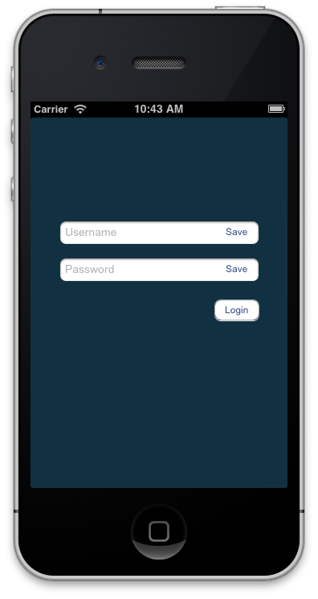
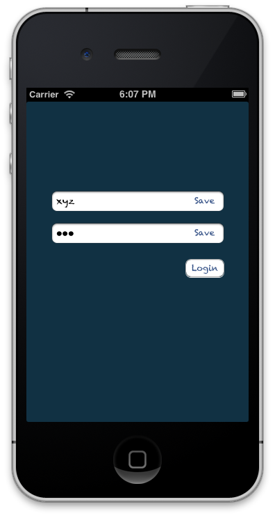
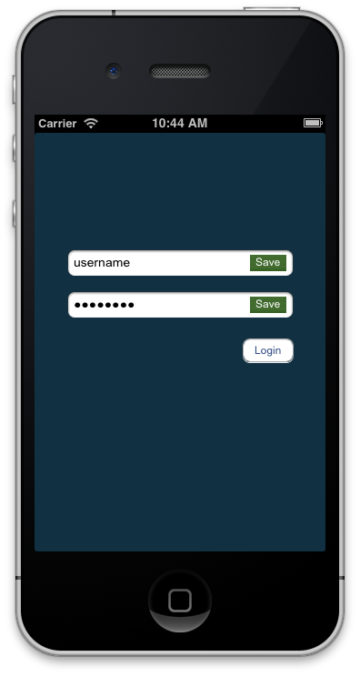

LoginCustom Component
================

Description:
------------

LoginCustomComponent is a stand alone component which is used to save user's credentials based on user's need and choice. 
It allows user to save or unsave username and/or password in login screen. Credentials will be retained (if saved) even when application is 
killed and restarted. It is similar to the option of checkmark (to remember credentials) we have on websites.  

Relevant Files to import/add to project:
------------

1) You need the LoginCustomComponentViewController.h, LoginCustomComponentViewController.m and LoginCustomComponentViewController.xib
files. You can either use buttonOff.png and buttonOn.png or use your own images for button save option.

2) You need to import Security.framework.

3) Add LoginComponent folder to your project which consistes of modified keychain wrapper and custom component. 

  Keychain wrapper: KeychainItemWrapper.h and KeychainItemWrapper.m

  Custom component: LoginCustomComponentViewController.h/.m/.xib and relevant images 

Dependencies:
-------------

KeychainWrapperItem - Wrapper provided by APPLE to use Keychains. I have modified it. I have added one method to reset saved username/password. 

KeychainItemWrapper.h

    // This is new method added th this wrapper
    -(void)removeObjectForKey:(NSString *)key;
    
KeychainItemWrapper.m 

     // This is custom method to remove object (actually set the object to empty string)
     -(void)removeObjectForKey:(NSString *)key
    {
      [keychainItemData setObject:@"" forKey:key];
      [self writeToKeychain];
    }

Usage:
------------

     1) Import custom controller .h file and create an instance of custom controller.

     Your Login Controller.h:

     @class LoginCustomComponentViewController;
     
     @property (nonatomic,strong)LoginCustomComponentViewController *loginComponent;

      2) Login Controller.m:

      #import "LoginCustomComponentViewController.h"

     - (void)viewDidLoad
    {
      [super viewDidLoad];
      loginComponent= [[LoginCustomComponentViewController alloc]initWithNibName:@"LoginCustomComponentViewController" bundle:nil];
      [self.view addSubview:loginComponent.view];
    
     // To add a method call to login button: 
      loginComponent= [[LoginCustomComponentViewController alloc]initWithNibName:@"LoginCustomComponentViewController" bundle:nil];
      [self.view addSubview:loginComponent.view];
    
     //Edit UI element properties as required or add more UI view on top of loginComponent
     //Example:
     //loginComponent.username.textColor = [UIColor redColor];
     // Do any additional setup after loading the view from its nib.
    }

Customization:
------------

    You can customize the login view, labels , buttons , images as per your requirement. 

    Example:
    loginComponent.username.textColor = [UIColor redColor];

Demo project: included for reference
------------

Video:

http://youtu.be/c7dCGxI6ubQ

LICENSE: 
================

Copyright (c) 2013 Mohit Jain.

Permission is hereby granted, free of charge, to any person obtaining a copy
of this software and associated documentation files (the "Software"), to deal
in the Software without restriction, including without limitation the rights
to use, copy, modify, merge, publish, distribute, sublicense, and/or sell
copies of the Software, and to permit persons to whom the Software is
furnished to do so, subject to the following conditions:

The above copyright notice and this permission notice shall be included in
all copies or substantial portions of the Software.

THE SOFTWARE IS PROVIDED "AS IS", WITHOUT WARRANTY OF ANY KIND, EXPRESS OR
IMPLIED, INCLUDING BUT NOT LIMITED TO THE WARRANTIES OF MERCHANTABILITY,
FITNESS FOR A PARTICULAR PURPOSE AND NONINFRINGEMENT. IN NO EVENT SHALL THE
AUTHORS OR COPYRIGHT HOLDERS BE LIABLE FOR ANY CLAIM, DAMAGES OR OTHER
LIABILITY, WHETHER IN AN ACTION OF CONTRACT, TORT OR OTHERWISE, ARISING FROM,
OUT OF OR IN CONNECTION WITH THE SOFTWARE OR THE USE OR OTHER DEALINGS IN
THE SOFTWARE.

